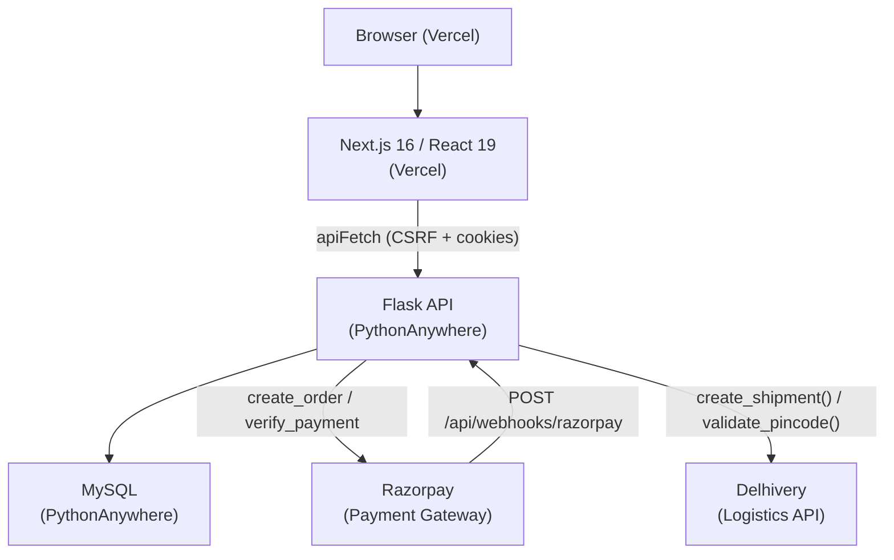
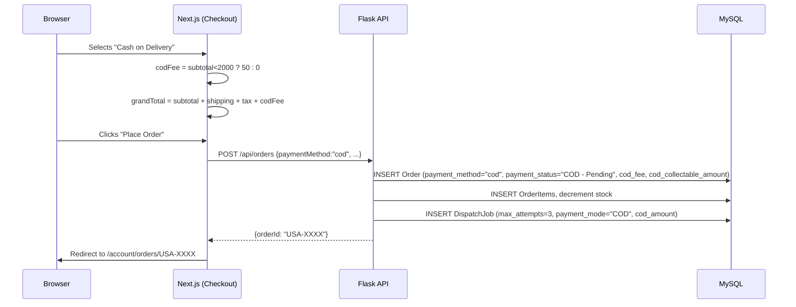
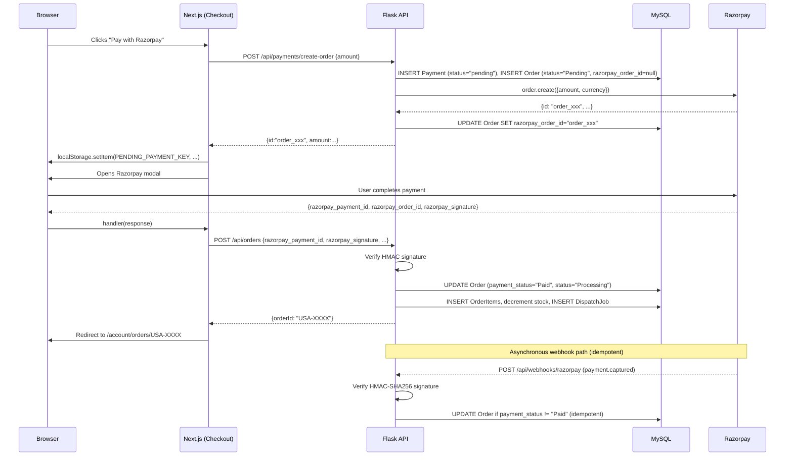
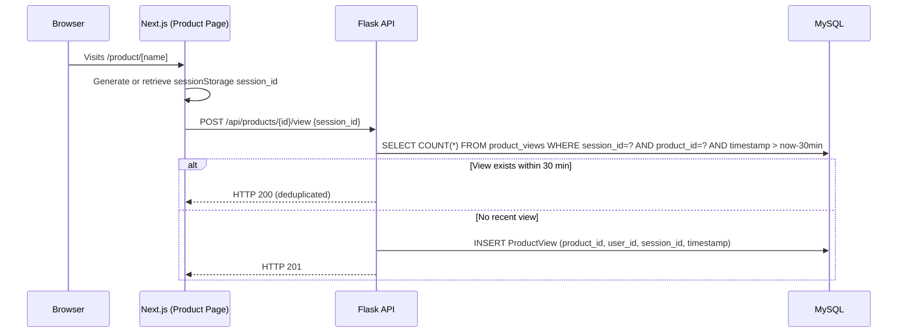

# Design Document — U.S. Atelier Platform Improvements

## Overview

This document describes the technical design for a broad platform improvement pass across the U.S. Atelier e-commerce site. The changes span twelve requirement areas: frontend accessibility and polish, ProductCard cleanup, View-All filter behaviour, COD checkout, Razorpay reliability, image performance, ProductView tracking, analytics expansion, backend cleanup, frontend error handling, WebP image upload, and structured API error contracts.

The frontend is Next.js 16 / React 19 on Vercel. The backend is Flask on PythonAnywhere with MySQL via SQLAlchemy (NullPool). All database migrations are additive only — no existing columns or tables are dropped or altered.

---

## Architecture

### System Diagram



### What Changes vs. What Stays the Same

| Area | Status |
|---|---|
| `apiFetch` in `lib/api-base.ts` | Unchanged — all frontend API calls already go through it |
| `delhivery_utils.py` — `create_shipment()` | Unchanged — already accepts `payment_mode` and `cod_amount` |
| `DispatchJob` model | Unchanged — already has `max_attempts`; requirement uses 3 retries (overrides default 5) |
| `Order` model | Unchanged — already has `payment_method`, `cod_fee`, `cod_collectable_amount`, `razorpay_order_id` |
| `Payment` model | Unchanged |
| `ProductView` model | **New** — additive migration |
| `POST /api/products/{id}/view` | **New endpoint** |
| `GET /api/admin/analytics/product-views` | **New endpoint** |
| `GET /api/admin/analytics/revenue-trend` | **New endpoint** |
| `POST /api/payments/create-order` | **Modified** — create DB Order record before returning Razorpay order ID |
| `POST /api/orders` | **Modified** — support COD path |
| `POST /api/webhooks/razorpay` | **Modified** — add HMAC-SHA256 signature verification, idempotency |
| `GET /api/admin/analysis` | **Modified** — add `total_orders`, `total_revenue`, `top_by_revenue`, `abandoned_cart_rate` |
| Image upload endpoint | **Modified** — Pillow WebP conversion |
| Global Flask error handlers | **New** — `@app.errorhandler(404)` and `@app.errorhandler(Exception)` |
| `components/product-card.tsx` | **Modified** — remove "View Details" overlay |
| `app/checkout/page.tsx` | **Modified** — add COD payment path |
| `app/admin/analysis/page.tsx` | **Modified** — new summary cards, revenue chart, top-by-revenue table |
| All `<Image>` usages across frontend | **Modified** — add `sizes`, `loading`, `priority` props |

---

## Database Schema Changes

### New: `ProductView` Model

Added to `models_mysql.py` alongside existing models. The table is created via `db_mysql.create_all()` (additive — no existing tables touched).

```python
class ProductView(db_mysql.Model):
    __tablename__ = "product_views"

    id         = db_mysql.Column(db_mysql.Integer, primary_key=True)
    product_id = db_mysql.Column(db_mysql.Integer, db_mysql.ForeignKey("products.id"), nullable=False, index=True)
    user_id    = db_mysql.Column(db_mysql.Integer, db_mysql.ForeignKey("users.id"), nullable=True)
    session_id = db_mysql.Column(db_mysql.String(128), nullable=True, index=True)
    timestamp  = db_mysql.Column(db_mysql.DateTime, default=datetime.utcnow, index=True)
```

**Indexes:** `product_id` (for view-count aggregations), `session_id` (for dedup queries), `timestamp` (for range filters).

No existing table columns are added, altered, or dropped. The pattern is consistent with the existing `db_mysql.create_all()` call already present in `app.py`.

### No Other Schema Changes

All other required fields (`payment_method`, `cod_fee`, `cod_collectable_amount`, `razorpay_order_id`, `idempotency_key` on `Order`) already exist in `models_mysql.py`. No `ALTER TABLE` statements are needed.

---

## Components and Interfaces

### Backend API — New Endpoints

#### `POST /api/products/{id}/view`

Records a product page view with session-level deduplication.

**Auth:** None required.

**Request body:**
```json
{ "session_id": "string (≤128 chars, optional)" }
```

**Logic:**
1. Look up product by `id`. If not found → HTTP 404 `{"error": "Product not found"}`.
2. If `session_id` is provided and `len(session_id) > 128` → HTTP 422.
3. If `session_id` is provided: query for an existing `ProductView` with same `product_id` and `session_id` where `timestamp >= utcnow - 30 minutes`. If found → return HTTP 200 (no insert).
4. Otherwise: insert new `ProductView` row. Return HTTP 201.

**Responses:**
- `201 Created` — view recorded
- `200 OK` — deduplicated (within 30-min window)
- `404 Not Found` — product not found
- `422 Unprocessable Entity` — session_id too long

---

#### `GET /api/admin/analytics/product-views`

Returns view counts per product for a given time range.

**Auth:** `@admin_required` (HTTP 401 if unauthenticated, HTTP 403 if non-admin).

**Query params:** `range` — one of `today`, `7d`, `30d`, `all`.

**Logic:**
1. If `range` is absent or unrecognized → HTTP 422 `{"error": "range must be one of: today, 7d, 30d, all"}`.
2. Build datetime cutoff based on `range` (UTC).
3. `SELECT product_id, COUNT(*) as view_count FROM product_views WHERE timestamp >= cutoff GROUP BY product_id ORDER BY view_count DESC`.
4. Left join with `products` table to get `product_name`. Use `"[Deleted]"` for orphaned rows.

**Response:**
```json
[
  { "product_id": 1, "product_name": "Ivory Silk Shirt", "view_count": 142 },
  ...
]
```

---

#### `GET /api/admin/analytics/revenue-trend`

Returns daily revenue for the last 30 calendar days (UTC), including zero-revenue days.

**Auth:** `@admin_required`.

**Logic:**
1. Generate a list of the last 30 calendar days in UTC.
2. Query `SUM(orders.total)` grouped by date for non-cancelled orders.
3. Merge with the full 30-day list, filling missing days with `0.0`.
4. Sort ascending by date.

**Response:**
```json
[
  { "date": "2025-05-01", "revenue": 4200.00 },
  { "date": "2025-05-02", "revenue": 0.0 },
  ...
]
```

---

### Backend API — Modified Endpoints

#### `POST /api/payments/create-order` (Modified)

**Change:** Before calling the Razorpay API to create an order, the endpoint now creates a `Payment` record AND a pending `Order` record in MySQL. This ensures the order exists in the DB before the Razorpay modal opens.

**New flow:**
1. Validate request body (`amount` required).
2. Create a `Payment` record (`status="pending"`, `checkout_payload_json=<serialized body>`).
3. Create an `Order` record (`status="Pending"`, `payment_status="Pending"`, `razorpay_order_id=None` initially).
4. Call Razorpay `client.order.create(...)`.
5. Update the `Order` and `Payment` records with the returned `razorpay_order_id`.
6. Return `{ "id": rzp_order_id, "amount": ..., "currency": "INR" }`.

If Razorpay call fails: mark the pending Order as `status="Failed"` and return HTTP 502.

---

#### `POST /api/orders` (Modified)

**Change:** Support `paymentMethod: "cod"` in the request body alongside the existing Razorpay path.

**COD path:**
1. Validate shipping fields.
2. Look up the pending `Order` by... actually for COD there is no prior Razorpay order. Create a new `Order` with:
   - `payment_method = "cod"`
   - `payment_status = "COD - Pending"`
   - `cod_fee = 50 if discounted_subtotal < 2000 else 0`
   - `cod_collectable_amount = subtotal - discount + shipping + tax + cod_fee`
3. Create `OrderItem` rows, decrement stock.
4. Enqueue a `DispatchJob` with `max_attempts=3`, passing `payment_mode="COD"` and `cod_amount=cod_collectable_amount` into a `dispatch_params_json` field (or existing mechanism).
5. Return `{ "orderId": order.order_number, "status": "COD - Pending" }`.

**Razorpay path (existing, unchanged in flow):** Verifies Razorpay signature, updates the pending Order created in `create-order`, creates OrderItem rows, enqueues prepaid DispatchJob.

---

#### `POST /api/webhooks/razorpay` (Modified)

**Change:** Add HMAC-SHA256 signature verification and idempotent order update.

**New logic:**
1. Read raw request body (before JSON parsing) — needed for HMAC verification.
2. Compute `hmac.new(RAZORPAY_WEBHOOK_SECRET.encode(), raw_body, sha256).hexdigest()`.
3. Compare with `X-Razorpay-Signature` header. If mismatch → HTTP 400, no action.
4. Parse event. If `event != "payment.captured"` → HTTP 200 (ignore).
5. Look up `Order` by `razorpay_order_id = payload.order_id`.
   - If found and `payment_status != "Paid"`: update to `payment_status="Paid"`, `status="Processing"`. Commit. Return HTTP 200.
   - If found and `payment_status == "Paid"` (already processed): return HTTP 200 (idempotent no-op).
   - If not found: look up `Payment` record by `razorpay_order_id`. If `checkout_payload_json` exists, attempt to create Order from it. If no Payment record: log ERROR, return HTTP 200.

---

#### `GET /api/admin/analysis` (Modified)

**New fields added to existing response:**

| Field | Type | Description |
|---|---|---|
| `total_orders` | integer | Count of non-cancelled Orders |
| `total_revenue` | float | Sum of `Order.total` for non-cancelled Orders, rounded to 2dp |
| `top_by_revenue` | array[10] | Products sorted by revenue (sum of `OrderItem.price × quantity`) |
| `abandoned_cart_rate` | float or null | % of add-event users with no order in 24h; null if no such users |

`top_by_revenue` element shape:
```json
{ "product_id": 1, "product_name": "Ivory Silk Shirt", "total_revenue": 18500.00 }
```

---

#### Image Upload Endpoint (Modified)

**Change:** Convert uploaded images to WebP using Pillow before saving.

**New logic (inside existing upload handler):**
1. Check file size. If `> 10 MB` → HTTP 400 `{"error": "File size exceeds 10 MB limit"}`.
2. Read file bytes. Attempt `Image.open(io.BytesIO(file_bytes))`.
   - If Pillow raises `UnidentifiedImageError` → HTTP 400 `{"error": "Unsupported image format"}`.
3. If format is already `"WEBP"`: skip conversion, use original bytes.
4. Otherwise: convert to RGB (handle RGBA → RGB for JPEG-origin files), save to `io.BytesIO` with `format="WEBP", quality=85`. Verify output dimensions == input dimensions.
5. Build filename: `f"{int(time.time())}_{secure_filename_stem}.webp"`.
6. Save to `backend/public/uploads/products/`.
7. If Pillow conversion raises any other exception: save original file (with original extension), log ERROR, return HTTP 200 with `{"url": "...", "warning": "Image could not be converted to WebP; original format saved"}`.
8. Return HTTP 200 `{"url": "<full_public_url>"}`.

---

### Frontend Component Changes

#### `components/product-card.tsx`

**Remove** the "View Details" CTA div:

```tsx
// DELETE this block entirely:
<div className="absolute inset-x-0 bottom-0 translate-y-0 transition-transform duration-300 bg-black/80 backdrop-blur-sm py-3 text-center">
  <span className="text-xs uppercase tracking-widest text-white">View Details</span>
</div>
```

All other behaviour — `<Link>` navigation, GSAP hover/leave, badges, out-of-stock overlay — is preserved unchanged.

Also add `sizes` and `loading` props to the `<Image>` component:

```tsx
<Image
  src={resolveMediaUrl(images[currentImage])}
  alt={product.name}
  fill
  sizes="(max-width: 767px) 50vw, (max-width: 1279px) 33vw, 25vw"
  loading="lazy"
  ref={imgRef as any}
  className="object-cover transition-opacity duration-300"
/>
```

For above-the-fold product grids (first row on listing pages), the parent page can pass a `priority` prop; the card itself defaults to `loading="lazy"`.

---

#### `app/checkout/page.tsx`

**New state:**
```tsx
const [paymentMethod, setPaymentMethod] = useState<"razorpay" | "cod">("razorpay")
```

**COD fee calculation (pure function, no side effects):**
```tsx
const codFee = paymentMethod === "cod" ? (discountedSubtotal < 2000 ? 50 : 0) : 0
const grandTotal = discountedSubtotal + shipping + tax + codFee
```

**Payment method selector UI** — rendered in the review step, before the "Place Order" button:
```tsx
<div className="space-y-3">
  <h3 className="uppercase tracking-widest text-xs text-gray-400">Payment Method</h3>
  {[
    { value: "razorpay", label: "Pay Online (Razorpay)", description: "Credit / Debit card, UPI, Netbanking" },
    { value: "cod", label: "Cash on Delivery", description: codFee > 0 ? `+₹${codFee} COD fee` : "No additional fee" },
  ].map(option => (
    <label key={option.value} className={`flex items-start gap-4 p-4 border cursor-pointer transition-all ${
      paymentMethod === option.value ? "border-white/40 bg-white/[0.03]" : "border-white/10 hover:border-white/20"
    }`}>
      <input
        type="radio"
        name="paymentMethod"
        value={option.value}
        checked={paymentMethod === option.value}
        onChange={() => setPaymentMethod(option.value as "razorpay" | "cod")}
        className="sr-only"
        aria-label={option.label}
      />
      {/* visual radio indicator + label */}
    </label>
  ))}
</div>
```

**COD order handler (`handleCODOrder`):**
```tsx
const handleCODOrder = async () => {
  if (!checkoutTermsAccepted) { /* show error */ return }
  setIsProcessing(true)
  try {
    const res = await apiFetch(API_BASE, "/api/orders", {
      method: "POST",
      headers: { "Content-Type": "application/json" },
      body: JSON.stringify({
        ...buildCheckoutPayload(),
        paymentMethod: "cod",
        codFee,
        grandTotal,
      }),
    })
    if (!res.ok) {
      const err = await res.json()
      setGlobalError(err.error || "Failed to place order")
      return
    }
    const data = await res.json()
    await completeSuccessfulOrder(data.orderId)
  } catch (err: any) {
    setGlobalError(`Something went wrong: ${err.message}`)
  } finally {
    setIsProcessing(false)
  }
}
```

The existing `handlePayAndPlaceOrder` handles the Razorpay path unchanged. The "Place Order" button dispatches to the correct handler based on `paymentMethod`.

---

#### `app/view-all/page.tsx`

The existing `FilterDropdown` component already implements the bottom-sheet / inline behaviour correctly using responsive Tailwind classes. The `urlCategory?.toLowerCase() === cat.name.toLowerCase()` comparison is already case-insensitive. No functional changes needed — only documentation and gap-class verification.

**Gap class audit (current implementation):**
- `gap-6` → 24px at mobile (0–767px) ✓
- `gap-8` → 32px at tablet (768–1279px) ✓
- `gap-10` → 40px at desktop (1280px+) ✓

These match the requirements exactly. No code change required.

---

#### `app/admin/analysis/page.tsx`

**New `AnalysisData` interface additions:**
```tsx
interface AnalysisData {
  // ... existing fields ...
  total_orders: number
  total_revenue: number
  top_by_revenue: { product_id: number; product_name: string; total_revenue: number }[]
  abandoned_cart_rate: number | null
}
```

**New `RevenueTrendData` type and fetch:**
```tsx
const [revenueTrend, setRevenueTrend] = useState<{ date: string; revenue: number }[]>([])

// In fetchData():
const trendRes = await apiFetch(API_BASE, "/api/admin/analytics/revenue-trend")
if (trendRes.ok) setRevenueTrend(await trendRes.json())
```

**Summary cards section** (rendered above existing Performance Matrix):
```tsx
<section className="grid grid-cols-2 gap-6 mb-12">
  <div className="bg-white/5 border border-white/10 p-6">
    <p className="text-[10px] uppercase tracking-widest text-gray-500 mb-2">Total Orders</p>
    <p className="text-3xl font-serif text-[#e8e8e3]">{data.total_orders.toLocaleString("en-IN")}</p>
  </div>
  <div className="bg-white/5 border border-white/10 p-6">
    <p className="text-[10px] uppercase tracking-widest text-gray-500 mb-2">Total Revenue</p>
    <p className="text-3xl font-serif text-[#e8e8e3]">₹{data.total_revenue.toLocaleString("en-IN", { minimumFractionDigits: 2 })}</p>
  </div>
</section>
```

**Revenue trend chart** (uses existing `recharts` `LineChart`):
```tsx
<section className="bg-white/5 border border-white/10 p-8 mb-12">
  <h2 className="text-sm uppercase tracking-[0.3em] font-bold text-[#e8e8e3] mb-8">30-Day Revenue Trend</h2>
  <ResponsiveContainer width="100%" height={200}>
    <LineChart data={revenueTrend}>
      <CartesianGrid strokeDasharray="3 3" stroke="rgba(255,255,255,0.05)" />
      <XAxis dataKey="date" tick={{ fontSize: 9, fill: "#666" }} tickFormatter={(d) => d.slice(5)} />
      <YAxis tick={{ fontSize: 9, fill: "#666" }} tickFormatter={(v) => `₹${(v/1000).toFixed(0)}k`} />
      <Tooltip contentStyle={{ backgroundColor: "#111", border: "1px solid #333", fontSize: 10 }} formatter={(v: number) => [`₹${v.toLocaleString("en-IN")}`, "Revenue"]} />
      <Line type="monotone" dataKey="revenue" stroke="#e8e8e3" strokeWidth={1.5} dot={false} />
    </LineChart>
  </ResponsiveContainer>
</section>
```

---

## Data Models

### `ProductView` (New)

| Column | Type | Nullable | Notes |
|---|---|---|---|
| `id` | INTEGER PK | No | Auto-increment |
| `product_id` | INTEGER FK → products.id | No | Indexed |
| `user_id` | INTEGER FK → users.id | Yes | Null for unauthenticated views |
| `session_id` | VARCHAR(128) | Yes | Indexed; used for 30-min dedup |
| `timestamp` | DATETIME | No | Default `datetime.utcnow`; indexed |

### `Order` (Existing — no changes)

Relevant existing columns:
- `payment_method` VARCHAR(20) — `"cod"` or `"prepaid"` (default)
- `payment_status` VARCHAR(50) — `"COD - Pending"`, `"Pending"`, `"Paid"`, etc.
- `cod_fee` FLOAT — ₹50 or ₹0
- `cod_collectable_amount` FLOAT — total the delivery agent collects
- `razorpay_order_id` VARCHAR(255) UNIQUE — set before modal opens (Requirement 5)
- `idempotency_key` VARCHAR(64) UNIQUE — guards duplicate order creation

### `DispatchJob` (Existing — `max_attempts` used as 3 for COD)

When enqueuing a COD dispatch job, set `max_attempts=3`. The existing retry scheduler already respects this field.

---

## Correctness Properties

*A property is a characteristic or behavior that should hold true across all valid executions of a system — essentially, a formal statement about what the system should do. Properties serve as the bridge between human-readable specifications and machine-verifiable correctness guarantees.*

### Property 1: COD Fee Invariant

*For any* order with `payment_method = "cod"`, the `cod_fee` shall be exactly ₹50 when `discounted_subtotal < 2000` and exactly ₹0 when `discounted_subtotal >= 2000`.

**Validates: Requirements 4.2, 4.3**

---

### Property 2: COD Collectable Amount Invariant

*For any* COD order, `cod_collectable_amount` must equal `subtotal - discount + shipping + tax + cod_fee`. No component may be omitted or double-counted.

**Validates: Requirements 4.5**

---

### Property 3: Payment Method Switch Removes COD Fee

*For any* order state where `paymentMethod = "cod"` and `codFee > 0`, switching `paymentMethod` to `"razorpay"` must result in `codFee = 0` and `grandTotal = discountedSubtotal + shipping + tax`.

**Validates: Requirements 4.4**

---

### Property 4: Razorpay Webhook Idempotency

*For any* `razorpay_order_id`, regardless of how many times the `payment.captured` webhook is delivered, the database shall contain at most one Order record matching that `razorpay_order_id` with `payment_status = "Paid"`. The order update is applied exactly once.

**Validates: Requirements 5.3**

---

### Property 5: ProductView Session Deduplication

*For any* `(session_id, product_id)` pair where `session_id` is non-null, at most one `ProductView` row with that pair shall exist with a `timestamp` within any 30-minute rolling window. Calls within the window return HTTP 200; calls outside the window (or with no session_id) insert a new row.

**Validates: Requirements 7.4**

---

### Property 6: Product View Endpoint Insert Correctness

*For any* valid `product_id` and any `session_id` (or no session_id) that does not trigger deduplication, a `POST /api/products/{id}/view` call shall insert exactly one `ProductView` row with `product_id` matching the URL parameter, `user_id` matching the session user (or null), and `timestamp` within a few seconds of the call.

**Validates: Requirements 7.3**

---

### Property 7: Analytics View Count Sort Order

*For any* dataset of `ProductView` records and any valid `range` parameter, `GET /api/admin/analytics/product-views` shall return results sorted strictly descending by `view_count`. No product with a lower view count shall appear before a product with a higher view count.

**Validates: Requirements 7.9**

---

### Property 8: Total Revenue Correctness

*For any* set of `Order` records, `total_revenue` returned by `/api/admin/analysis` shall equal the arithmetic sum of `order.total` for all orders where `status != "Cancelled"`. No cancelled order total shall be included; no non-cancelled order total shall be omitted.

**Validates: Requirements 8.2**

---

### Property 9: Revenue Trend Completeness

*For any* day range query, `GET /api/admin/analytics/revenue-trend` shall return exactly 30 entries covering each of the last 30 calendar days (UTC), sorted ascending by date. Days with no orders shall have `revenue = 0.0`, not be omitted.

**Validates: Requirements 8.4**

---

### Property 10: Top-By-Revenue Sort Order

*For any* dataset of non-cancelled orders, `top_by_revenue` in `/api/admin/analysis` shall be sorted strictly descending by `total_revenue` and contain at most 10 elements. The `total_revenue` for each product equals the sum of `OrderItem.price * OrderItem.quantity` across all non-cancelled orders containing that product.

**Validates: Requirements 8.6**

---

### Property 11: Conversion Rate Calculation Correctness

*For any* product with `view_count > 0`, the conversion percentage displayed on the analytics page shall equal `(distinct_orders_containing_product / view_count) * 100`, rounded to 2 decimal places. *For any* product with `view_count = 0`, the displayed value shall be `"—"`.

**Validates: Requirements 8.8**

---

### Property 12: Abandoned Cart Rate Correctness

*For any* dataset of `CartEvent` and `Order` records, `abandoned_cart_rate` shall equal `(count of distinct user_emails with an "add" event but no Order within 24 hours of their earliest add event) / (count of all distinct user_emails with at least one "add" event) * 100`, rounded to 1 decimal place. When there are zero users with add events, the value shall be `null`.

**Validates: Requirements 8.9**

---

### Property 13: WebP Conversion Preserves Dimensions

*For any* valid input image with pixel dimensions `(W, H)`, after Pillow WebP conversion the output image dimensions shall be exactly `(W, H)` — zero pixel difference in both width and height.

**Validates: Requirements 11.3**

---

### Property 14: WebP Output Filename Pattern

*For any* uploaded file with any original filename, the saved filename shall match the pattern `{T}_{stem}.webp`, where `T` is a non-negative integer Unix timestamp and `stem` is the output of `secure_filename` applied to the original base name (without extension). Path traversal sequences shall not appear in the saved filename.

**Validates: Requirements 11.6**

---

### Property 15: API Error Responses Are Always JSON

*For any* request to any Flask route that results in an error response (4xx or 5xx), the response shall have `Content-Type: application/json` and a body that is valid, parseable JSON containing at least an `"error"` key with a non-empty string value.

**Validates: Requirements 9.2, 12.1, 12.2, 12.3, 12.4, 12.5, 12.6**

---

### Property 16: ProductCard Has No "View Details" Overlay

*For any* product object (with any combination of fields, flags, stock values, and image arrays), rendering `<ProductCard product={p} />` shall not produce any DOM node containing the text "View Details" or any visually overlaying element with an equivalent CTA label.

**Validates: Requirements 2.1**

---

### Property 17: ProductCard Link href Correctness

*For any* product with any `name` string, the `href` of the wrapping `<Link>` in `<ProductCard>` shall equal `"/product/" + encodeURIComponent(product.name)`. The encoding shall match the browser-native `encodeURIComponent` function for all Unicode strings.

**Validates: Requirements 2.2**

---

### Property 18: Category URL Matching Is Case-Insensitive

*For any* category name string `C` stored in the database and any string `Q` such that `Q.toLowerCase() === C.toLowerCase()`, passing `?category=Q` in the URL shall cause the View-All page to pre-select the tab for category `C` and filter products to that category, regardless of the case differences between `Q` and `C`.

**Validates: Requirements 3.6**

---

## Error Handling

### Frontend

Every `apiFetch` call must be wrapped in a `try/catch` block that sets visible UI state. The pattern to follow:

```tsx
try {
  const res = await apiFetch(API_BASE, "/api/some-endpoint", { ... })
  if (!res.ok) {
    const err = await res.json()
    setError(err.error || "Something went wrong")
    return
  }
  const data = await res.json()
  // handle success
} catch (err: any) {
  setError(err.message || "Network error. Please try again.")
}
```

The existing `apiFetch` in `lib/api-base.ts` already handles CSRF refresh on 403 and global 401 redirect. Components are responsible for non-auth error display.

No Promise chains (`.then()`) without a paired `.catch()` are permitted in production source files.

### Backend

#### Global Error Handlers

Two handlers are registered in `app.py` after all routes:

```python
import traceback

@app.errorhandler(404)
def not_found(e):
    return jsonify({"error": "Not found"}), 404

@app.errorhandler(Exception)
def internal_error(e):
    app.logger.error("Unhandled exception: %s\n%s", str(e), traceback.format_exc())
    return jsonify({"error": "Internal server error"}), 500
```

In production (`FLASK_ENV=production`), the traceback is written to the server log only — never included in the response body.

#### Structured Error Responses

All route handlers follow this contract:

| Condition | HTTP Status | JSON Body |
|---|---|---|
| Missing/invalid field | 400 | `{"error": "<field>: <constraint>"}` |
| Unauthenticated | 401 | `{"error": "Authentication required"}` |
| Authenticated but not admin | 403 | `{"error": "Admin access required"}` |
| Resource not found | 404 | `{"error": "Not found"}` |
| Validation constraint (e.g., session_id too long) | 422 | `{"error": "<description>"}` |
| Unhandled exception | 500 | `{"error": "Internal server error"}` |

All `print()` statements in `app.py` and other backend files are replaced with `app.logger.info/debug/error(...)` calls.

---

## Data Flow Diagrams

### COD Checkout Flow



### Razorpay Reliable Checkout Flow



### Product View Tracking Flow



---

## Testing Strategy

### Dual Testing Approach

Unit tests cover specific examples, edge cases, and error conditions. Property-based tests verify universal invariants across many generated inputs. Both are necessary for comprehensive coverage.

### Property-Based Testing Library

**Python backend:** [`hypothesis`](https://hypothesis.readthedocs.io/) — the standard PBT library for Python. Each property test runs a minimum of 100 iterations.

**TypeScript frontend:** [`fast-check`](https://fast-check.dev/) — the standard PBT library for TypeScript/JavaScript. Each property test runs a minimum of 100 iterations.

### Property Test Configuration

Each test is tagged with a comment in the format:
```
# Feature: usa-platform-improvements, Property N: <property text>
```

Minimum 100 iterations per property test (Hypothesis default; fast-check uses `fc.assert(fc.property(...), { numRuns: 100 })`).

### Unit Test Focus Areas

**Backend (pytest):**
- COD order creation with various subtotals (verify fee and collectable amount)
- Webhook signature verification (valid signature → process, invalid → 400)
- Webhook idempotency (second call on already-Paid order → no-op)
- ProductView dedup (same session, same product, within 30 min → 200; outside window → 201)
- Revenue trend — 30 entries including zero-revenue days
- WebP conversion error fallback (Pillow exception → save original, return warning)
- Global error handler (unhandled exception → JSON 500)
- 404 handler (unknown route → JSON 404)

**Frontend (Jest / React Testing Library):**
- ProductCard renders no "View Details" text
- ProductCard `href` equals `"/product/" + encodeURIComponent(product.name)`
- COD fee display updates when payment method changes
- `handleCODOrder` calls `/api/orders` with correct payload and redirects on success
- Analytics page renders summary cards with data from API

### Integration Tests

- Full COD checkout flow (create order → verify DispatchJob created with COD mode)
- Razorpay webhook → Order status update pipeline
- Image upload → WebP file saved with correct naming pattern
- `/api/admin/analytics/revenue-trend` returns 30 days of data

### What Property-Based Tests Are NOT Used For

- Infrastructure wiring (DispatchJob → Delhivery call) — integration test instead
- UI rendering and layout (breakpoint tests, focus indicators) — snapshot / E2E tests
- One-shot setup checks (table creation, env var presence) — smoke tests
